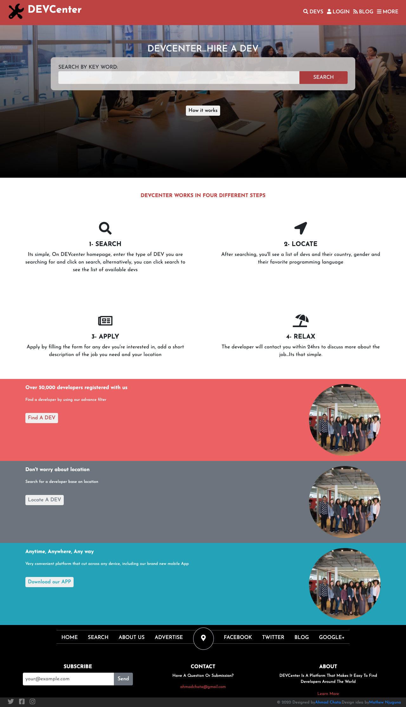

# DEVCenter
Microverse HTML/CSS Capstone Project.

> This is a capstone project for HTML/CSS, the aim of this project is to test your knowledge in HTML, CSS, Bootstrap.

The DEVCenter is website where you find developers, It has a homepage, search page and details page.
The search page can be accessed when you click any of the search buttons, whether in the header or in the footer.
The details page can be accessed when you click any of the card contained in the search page, It has a sign up and sign in form.

## Built With

- HTML
- Bootstrap 4
- CSS
- Google Fonts
- Font Awesome icons

## Live Demo

[Live Demo Link](https://raw.githack.com/ahmadchata/dev-directory/homepage/index.html)

## Author

👤 **Ahmad Chata**

- Github: [@ahmadchata](https://github.com/ahmadchata)
- Twitter: [@ahmadchata](https://twitter.com/ahmadchata)
- Linkedin: [Ahmad Chata](https://www.linkedin.com/in/ahmad-chata-957b9b51/)

## 🤝 Contributing

Contributions, issues and feature requests are welcome! Start by:

- Forking the project
- Cloning the project to your local machine
- `cd` into the Youtube-Replica project directory
- Run `git checkout -b your-branch-name`
- Make your contributions
- Push your branch up to your forked repository
- Open a Pull Request with a detailed description to the development branch of the original project for a review

## Show Support

- Give a ⭐ if you like this project.

## Acknowledgements

- Hat tip to [Mathew Njuguna and others on Behance](https://www.behance.net/mathewnjuguna) for the original design.
- Microverse

## 📝 License

This project is [MIT](https://opensource.org/licenses/MIT) licensed.